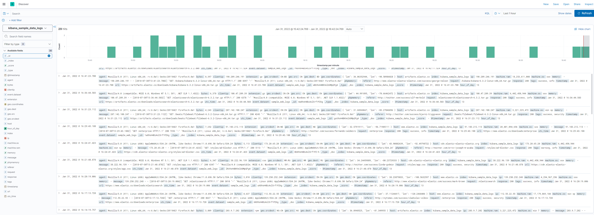
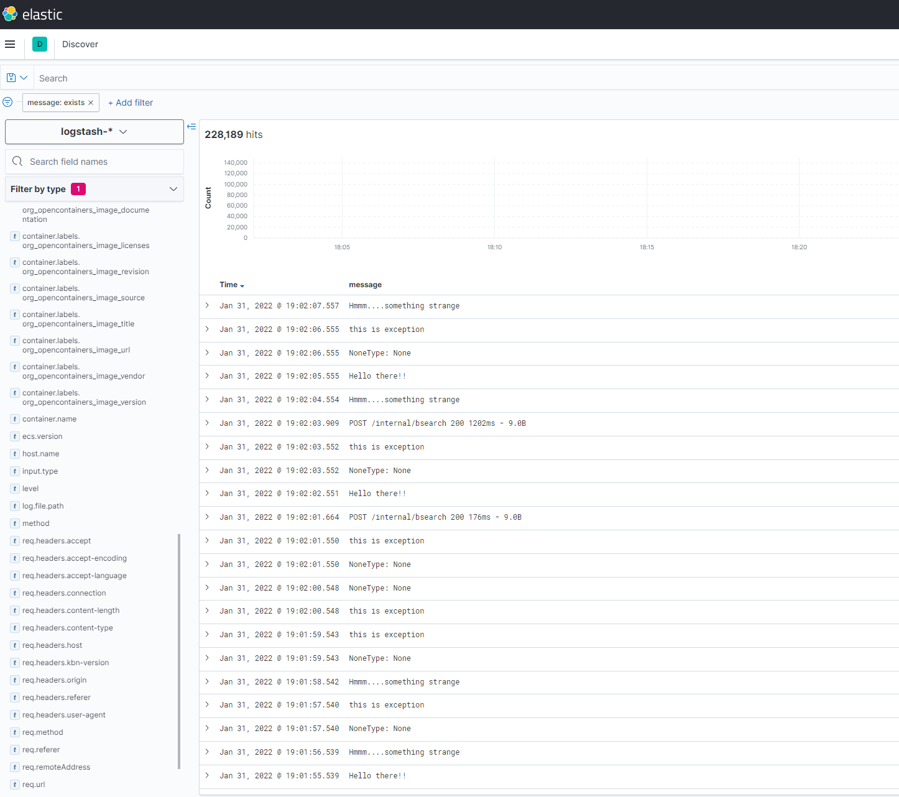

# 10.04. ELK

#### 1.
```bash
$ sudo sysctl -w vm.max_map_count=262144
vm.max_map_count = 262144
```


#### 2.




```bash
# cat docker-compose.yml
version: '2.2'
services:

  es-hot:
    image: docker.elastic.co/elasticsearch/elasticsearch:7.11.0
    container_name: es-hot
    environment:
      - node.name=es-hot
      - cluster.name=es-docker-cluster
      - discovery.seed_hosts=es-warm
      - cluster.initial_master_nodes=es-hot,es-warm
      - bootstrap.memory_lock=true
      - "ES_JAVA_OPTS=-Xms512m -Xmx512m"
    volumes:
      - data01:/usr/share/elasticsearch/data:Z
    ulimits:
      memlock:
        soft: -1
        hard: -1
      nofile:
        soft: 65536
        hard: 65536
    ports:
      - 9200:9200
    networks:
      - elastic
    depends_on:
      - es-warm

  es-warm:
    image: docker.elastic.co/elasticsearch/elasticsearch:7.11.0
    container_name: es-warm
    environment:
      - node.name=es-warm
      - cluster.name=es-docker-cluster
      - discovery.seed_hosts=es-hot
      - cluster.initial_master_nodes=es-hot,es-warm
      - bootstrap.memory_lock=true
      - "ES_JAVA_OPTS=-Xms512m -Xmx512m"
    volumes:
      - data02:/usr/share/elasticsearch/data:Z
    ulimits:
      memlock:
        soft: -1
        hard: -1
      nofile:
        soft: 65536
        hard: 65536
    networks:
      - elastic

  kibana:
    image: docker.elastic.co/kibana/kibana:7.11.0
    container_name: kibana
    ports:
      - 5601:5601
    environment:
      ELASTICSEARCH_URL: http://es-hot:9200
      ELASTICSEARCH_HOSTS: '["http://es-hot:9200","http://es-warm:9200"]'
    networks:
      - elastic
    depends_on:
      - es-hot
      - es-warm

  logstash:
    image: docker.elastic.co/logstash/logstash:6.3.2
    container_name: logstash
    ports:
      - 5046:5046
    volumes:
      - ./configs/logstash.conf:/etc/logstash/conf.d/logstash.conf:Z
      - ./configs/logstash.yml:/opt/logstash/config/logstash.yml:Z
      - ./configs/logstash.conf:/usr/share/logstash/pipeline/logstash.yml:Z
    networks:
      - elastic
    depends_on:
      - es-hot
      - es-warm

  filebeat:
    image: "docker.elastic.co/beats/filebeat:7.2.0"
    container_name: filebeat
    privileged: true
    user: root
    volumes:
      - ./configs/filebeat.yml:/usr/share/filebeat/filebeat.yml:Z
      - /var/lib/docker:/var/lib/docker:Z
      - /var/run/docker.sock:/var/run/docker.sock:Z
    depends_on:
      - logstash
    networks:
      - elastic

  some_application:
    image: library/python:3.9-alpine
    container_name: some_app
    volumes:
      - ./pinger/run.py:/opt/run.py:Z
    entrypoint: python3 /opt/run.py

volumes:
  data01:
    driver: local
  data02:
    driver: local
  data03:
    driver: local

networks:
  elastic:
    driver: bridge
```
``bash
# cat configs/filebeat.yml
filebeat.inputs:
  - type: container
    paths:
      - '/var/lib/docker/containers/*/*.log'
    json.keys_under_root: true

processors:
  - add_docker_metadata:
      host: "unix:///var/run/docker.sock"

  - decode_json_fields:
      fields: ["message"]
      target: "json"
      overwrite_keys: true
  - add_docker_metadata: ~


output.logstash:
  hosts: ["logstash:5046"]

logging.json: true
logging.metrics.enabled: false
```
```bash
# cat configs/filebeat.yml
filebeat.inputs:
  - type: container
    paths:
      - '/var/lib/docker/containers/*/*.log'
    json.keys_under_root: true

processors:
  - add_docker_metadata:
      host: "unix:///var/run/docker.sock"

  - decode_json_fields:
      fields: ["message"]
      target: "json"
      overwrite_keys: true
  - add_docker_metadata: ~


output.logstash:
  hosts: ["logstash:5046"]

logging.json: true
logging.metrics.enabled: false
root@elk:/opt/elk# cat configs/logstash.conf
input {
  beats {
    port => 5046
    codec => json
  }
}

filter {
  json {
    source => "message"
  }
}

output {
  elasticsearch {
    hosts => ["es-hot:9200"]
    index => "logstash-%{+YYYY.MM.dd}"
  }
  stdout { codec => rubydebug }
}
```